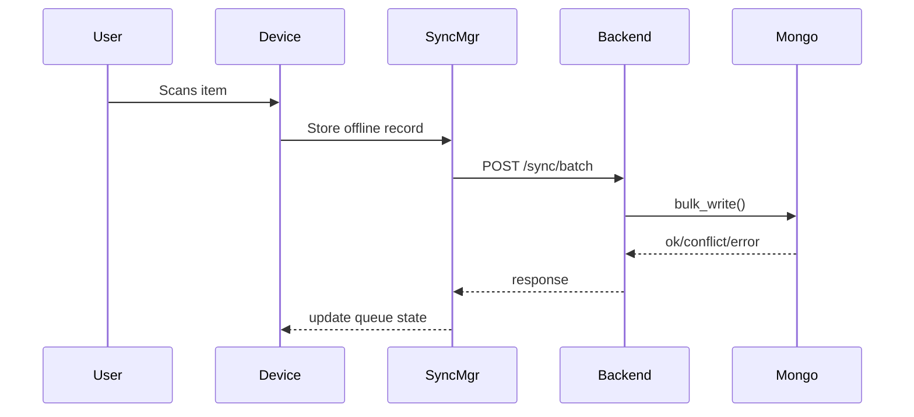
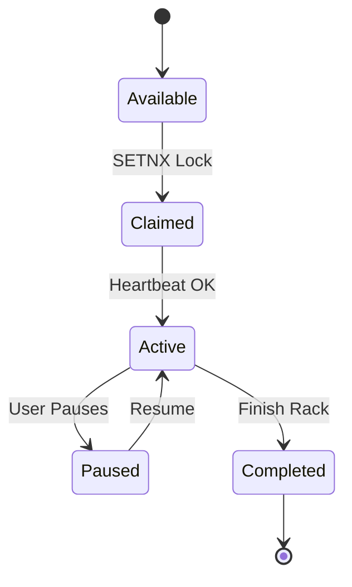
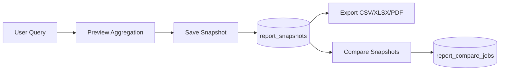

# StockVerify – Technical & Functional Requirements Specification (Offline Sync + Reporting)

**Version 1.0 – Lavanya Mart**

## Table of Contents

1. [Introduction](#1-introduction)
2. [System Overview](#2-system-overview)
3. [Architecture Summary](#3-architecture-summary)
4. [Functional Requirements](#4-functional-requirements)
   - 4.1 [Stock Verification Workflow](#41-stock-verification-workflow)
   - 4.2 [Rack & Floor Management](#42-rack--floor-management)
   - 4.3 [Multi-User Concurrency](#43-multi-user-concurrency)
   - 4.4 [Offline-First Operation](#44-offline-first-operation)
   - 4.5 [Sync & Retry Logic](#45-sync--retry-logic)
   - 4.6 [Conflict Handling](#46-conflict-handling)
   - 4.7 [User Management & Sessions](#47-user-management--sessions)
5. [Technical Requirements](#5-technical-requirements)
   - 5.1 [Frontend Architecture](#51-frontend-architecture)
   - 5.2 [Backend Architecture](#52-backend-architecture)
   - 5.3 [MongoDB Design](#53-mongodb-design)
   - 5.4 [Redis Locks & Pub/Sub](#54-redis-locks--pubsub)
   - 5.5 [Reporting & Snapshot System](#55-reporting--snapshot-system)
   - 5.6 [Admin Dashboard](#56-admin-dashboard)
   - 5.7 [Performance Requirements](#57-performance-requirements)
6. [Mermaid Diagrams](#6-mermaid-diagrams)
7. [Advanced Enhancements](#7-advanced-enhancements)
8. [Security & Compliance](#8-security--compliance)
9. [Testing Strategy](#9-testing-strategy)
10. [PR Implementation Roadmap](#10-pr-implementation-roadmap)
11. [Appendices](#11-appendices)

---

## 1. Introduction

This document provides a complete functional and technical specification for the **StockVerify Offline-First Multi-User Inventory Verification System**, developed for Lavanya Mart.

The system must reliably support:

- ✅ **20 concurrent users**
- ✅ **Offline-first operation**
- ✅ **LAN-based sync**
- ✅ **Fast rack-based verification workflows**
- ✅ **Full data capture**: qty, damage, serials, MRP, UOM, item condition, mfg date
- ✅ **Robust reporting engine** using MongoDB snapshots
- ✅ **Admin dashboards**, insights, imports, exports, compare tools

This document consolidates all requirements from previous discussions into a single, production-ready specification.

---

## 2. System Overview

**StockVerify** is a mobile-first stock verification system with the following goals:

- ✅ Accurate item verification during stock audits
- ✅ Multi-user rack-based workflow
- ✅ Offline operation with automatic syncing
- ✅ High-speed scanning
- ✅ Conflict-free data capture
- ✅ Visual dashboards for supervisors
- ✅ Enterprise-grade reporting (snapshots, comparisons, insights)

**Tech Stack:**
- **Backend**: MongoDB + Redis + FastAPI
- **Frontend**: React Native (Expo)

---

## 3. Architecture Summary

### High-Level Architecture

```mermaid
flowchart LR
    A[User Device] --> B[Offline Queue]
    B --> C[Sync Manager]
    C --> D[/api/sync/batch]
    D --> E[Backend API Service]
    E --> F[(MongoDB)]
    E --> G[(Redis - Locks + PubSub)]
    E --> H[[Worker Jobs - Exports, Imports, Compare]]
    H --> F
    A --> I[Admin Dashboard]
    I --> E
```

---

## 4. Functional Requirements

### 4.1 Stock Verification Workflow

The verifier must be able to:

1. **Scan/write/search for product**
2. **View master details** from SQL (read-only)
3. **Verify/update:**
   - Verified Quantity
   - Damage Quantity
   - Serial Numbers (multi-mode input)
   - Manufacturing Date
   - UOM / MRP
   - Category / Subcategory
   - Item Condition
   - Attach evidence photos (optional)
4. **Save partial** (offline)
5. **Finalize item**
6. **Mark for re-verification**

### 4.2 Rack & Floor Management

#### Floor List:
- Ground
- First
- Second
- Upper Godown
- Back Godown
- Damage Area

#### Rack Requirements:

**Racks are single-user claimed**

Each rack has:
- Floor
- Status (available, reserved, active, paused, completed)
- Active session ID

#### Rack Actions:
- Claim
- Pause
- Resume
- Finish
- Re-verify

### 4.3 Multi-User Concurrency

- ✅ Up to **20 users** working in parallel
- ✅ **Rack lock** via Redis `SETNX` + TTL
- ✅ **Real-time updates** using Redis Pub/Sub
- ✅ **Conflict-free** item updates
- ✅ **Per-user session** monitoring

#### Performance Goals:
- Rack claim < 200ms
- Sync batch processing < 500ms
- No UI lag during scanning

### 4.4 Offline-First Operation

The system must function **without network**:

#### Offline Queue

Stored locally with:
- Record ID
- Session ID
- Rack ID
- Floor
- Payload
- Created timestamp
- Retry count

#### Local Save Occurs for:
- Partial saves
- Finalized items
- Failed sync attempts

#### Sync Manager
- Batch size: 100–200
- Max parallel requests: 2
- Exponential backoff: 2s → 5min
- Resumes automatically on reconnect

### 4.5 Sync & Retry Logic

#### Endpoints:
- `/api/sync/batch`
- `/api/sync/heartbeat`

#### Server Response Format:
```json
{
  "ok": [...],
  "conflicts": [...],
  "errors": [...]
}
```

#### Retries Continue Until:
- Maximum retries reached
- Server accepts
- Supervisor resolves conflict

### 4.6 Conflict Handling

#### Conflicts Occur When:
- Serial duplicated
- Invalid mfg date
- Damage qty > verified qty
- Barcode mismatch

#### Client UI:
- Conflict Modal
- Supervisor Resolution Interface

### 4.7 User Management & Sessions

- ✅ Login with profile photo (optional)
- ✅ Track user productivity
- ✅ Session lifespan: until rack is completed
- ✅ Mandatory heartbeat to maintain lock

---

## 5. Technical Requirements

### 5.1 Frontend Architecture

**Technology**: React Native (Expo)

**Components:**
- Offline Storage (AsyncStorage/MMKV/Realm)
- SyncManager
- ConflictModal
- NetworkBanner
- SessionHUD
- Pre-fetch product metadata

### 5.2 Backend Architecture

**Technology**: FastAPI

**Components:**
- Redis (locking & pub/sub)
- MongoDB for all write operations
- Worker queue for heavy jobs
- Asynchronous non-blocking request handler

### 5.3 MongoDB Design

#### Collections:
- `verification_records`
- `verification_sessions`
- `item_serials`
- `report_snapshots`
- `report_compare_jobs`

#### Indexes:
- `client_record_id` (unique)
- `serial_numbers`
- `rack_id` + `floor`
- `created_at`
- Snapshot metadata

### 5.4 Redis Locks & Pub/Sub

#### Used For:
- Rack lock acquisition
- Rack release
- Presence updates
- Multi-user session awareness

**Lock TTL**: 60 seconds, renewed every 20–30 seconds.

### 5.5 Reporting & Snapshot System

#### Admin Features Include:
- Saved snapshots
- Query builder
- Group-by reports
- Export: CSV / XLSX / PDF
- Import (Preview + Commit)
- Compare two snapshots
- KPI dashboard

#### Snapshot Content:
- Summary
- Aggregated totals
- Row-level data
- Metadata

### 5.6 Admin Dashboard

#### Modes:
- Query Mode
- Snapshot Mode
- Import Mode (Dry-run validation)
- Compare Mode
- Insights Mode

#### Detailed Features:
- Audit reports
- Serial usage tracking
- Damage trends
- Floor performance heatmap

### 5.7 Performance Requirements

- ✅ **20 concurrent users** fully supported
- ✅ MongoDB bulk write throughput ≥ **100 ops/sec**
- ✅ Average API latency < **300ms**
- ✅ Offline queue drains **2000 items** in < **5 min** on good network
- ✅ Rack claim conflict resolution < **200ms**

---

## 6. Mermaid Diagrams

### 6.1 System Flow

```mermaid
flowchart TD
    A[Scan Item] --> B[Product Card]
    B --> C[Save Partial]
    B --> D[Finalize Item]
    C --> E[Offline Queue]
    D --> E
    E -->|Online| F[Sync Manager]
    F --> G[/api/sync/batch]
    G --> H[(MongoDB)]
```

### 6.2 Sync Pipeline



### 6.3 Rack Session Lifecycle



### 6.4 Reporting Engine



---

## 7. Advanced Enhancements

Already discussed and included:

- ✅ **Smart Prefetching**
- ✅ **Data Quality Score**
- ✅ **Auto-update App Packages**
- ✅ **Background Sync**
- ✅ **Supervisor Alerts**
- ✅ **Role-based Access** (Verifier, Supervisor, Admin, Auditor)
- ✅ **Network Stability Boosters** (retry management, throttling)
- ✅ **Real-time Health Dashboard**
- ✅ **Import column mapping & validation**
- ✅ **Auto backup & integrity checks**

---

## 8. Security & Compliance

- ✅ Token-based authentication
- ✅ Device registration & trust model
- ✅ Role-based access control
- ✅ Encrypted storage for sensitive metadata
- ✅ Rate limiting on public endpoints
- ✅ Secure redis/mongo access

---

## 9. Testing Strategy

### Unit Tests
- SyncManager
- OfflineQueue
- Redis Locks
- Conflict detection
- Mongo bulk write logic

### Integration Tests
- Multi-user rack workflow
- Offline-to-online transition
- Serial uniqueness validation

### Load Tests (k6)
- 20 concurrent devices
- 5,000 batch sync requests
- Rack claim race conditions

---

## 10. PR Implementation Roadmap

### Phase 1 – Foundations
- Mongo schemas & indexes
- Redis lock module
- Batch sync endpoint
- SyncManager (frontend)

### Phase 2 – Rack Sessions
- Session HUD
- Rack claim/pause/resume
- Supervisor re-verification

### Phase 3 – Reporting Module
- Query builder
- Snapshot engine
- Export engine
- Compare engine
- Import preview

### Phase 4 – Enhancements
- Insights dashboard
- Auto-update system
- Health monitoring
- Device trust registry

---

## 11. Appendices

### Appendix A – Supported Fields

- SKU
- Barcode
- Verified Qty
- Damage Qty
- Serial Numbers
- Mfg Date
- MRP
- UOM
- Category
- Subcategory
- Item Condition
- Evidence Photos

### Appendix B – Rack States

- Available
- Claimed
- Active
- Paused
- Completed
- Re-verify Requested

---

**Document Version**: 1.0
**Last Updated**: December 11, 2025
**Status**: Production Ready
**Maintained By**: Development Team
