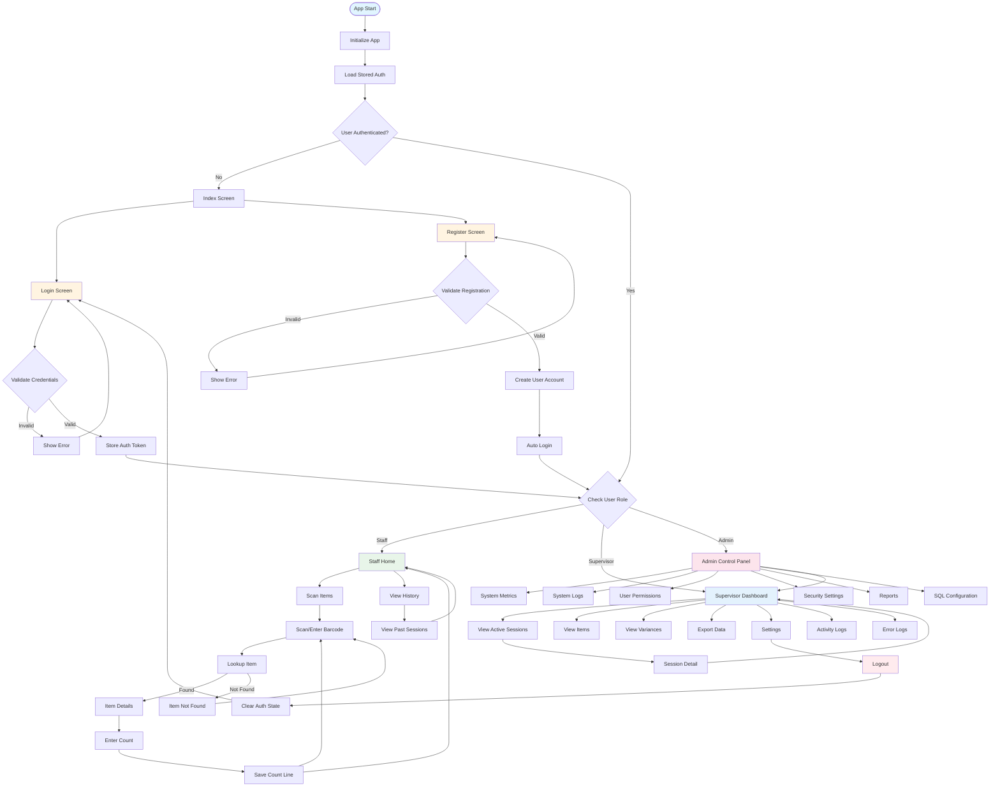
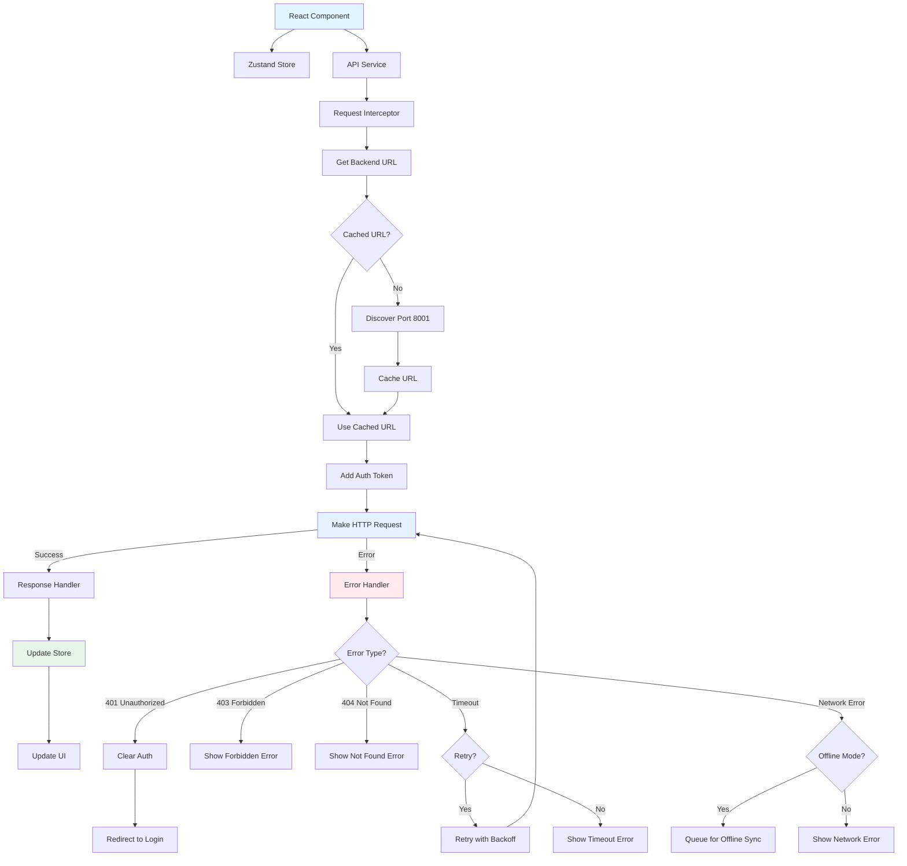

# Frontend Application Flow Chart

This document contains comprehensive flowcharts for the frontend application using Mermaid diagram syntax.

## Viewing the Flowcharts

These flowcharts use Mermaid syntax and can be viewed in:
- GitHub (renders automatically)
- VS Code with Mermaid extension
- Online Mermaid editors (https://mermaid.live)
- Documentation tools that support Mermaid

## Complete Application Flow

See the full flowcharts in the file. The document includes:

1. **Complete Application Flow** - Overall app navigation and user journey
2. **Authentication Flow** - Login, registration, token management
3. **Role-Based Navigation** - Staff, Supervisor, Admin flows
4. **Barcode Scanning Flow** - Complete barcode scanning process
5. **Data Flow - API Calls** - How API requests are handled
6. **Error Handling Flow** - Error management and recovery
7. **Offline/Online Sync Flow** - Offline mode and sync logic
8. **Component Lifecycle Flow** - React component lifecycle
9. **Screen Navigation Map** - All screens and their relationships


## 1. Complete Application Flow



## 2. Authentication Flow

```mermaid
flowchart TD
    AuthStart([Authentication Start]) --> CheckStoredToken{Token in Storage?}

    CheckStoredToken -->|No| ShowLogin[Show Login Screen]
    CheckStoredToken -->|Yes| ValidateToken[Validate Token with /auth/me]

    ValidateToken -->|Valid| SetUser[Set User in Store]
    ValidateToken -->|Invalid| ClearToken[Clear Invalid Token]
    ClearToken --> ShowLogin

    ShowLogin --> UserInput[User Enters Credentials]
    UserInput --> SubmitLogin[Submit Login]
    SubmitLogin --> CallAPI[POST /api/auth/login]

    CallAPI -->|Success| ReceiveTokens[Receive Access & Refresh Tokens]
    CallAPI -->|Error| ShowError[Show Error Message]
    ShowError --> UserInput

    ReceiveTokens --> StoreTokens[Store Tokens in AsyncStorage]
    StoreTokens --> FetchUser[Fetch User Details]
    FetchUser --> SetUser

    SetUser --> CheckRole{Role?}
    CheckRole -->|Staff| RedirectStaff[/staff/home]
    CheckRole -->|Supervisor| RedirectSupervisor[/supervisor/dashboard]
    CheckRole -->|Admin| RedirectAdmin[/admin/control-panel]

    style AuthStart fill:#e1f5ff
    style ShowLogin fill:#fff4e1
    style ReceiveTokens fill:#e8f5e9
    style ShowError fill:#ffebee
```

## 3. Barcode Scanning Flow

```mermaid
flowchart TD
    ScanStart([Start Scanning]) --> ScanMethod{Scan Method?}

    ScanMethod -->|Camera| CameraScan[Open Camera Scanner]
    ScanMethod -->|Manual| ManualEntry[Manual Entry]

    CameraScan --> CaptureBarcode[Capture Barcode]
    CaptureBarcode --> ValidateBarcode{Valid Format?}

    ManualEntry --> ValidateBarcode

    ValidateBarcode -->|Invalid| ShowFormatError[Show Format Error]
    ShowFormatError --> ScanStart

    ValidateBarcode -->|Valid| CheckBackend{Backend Health Check}

    CheckBackend -->|Unavailable| ShowBackendError[Show Backend Error]
    ShowBackendError --> RetryOption{Retry?}
    RetryOption -->|Yes| CheckBackend
    RetryOption -->|No| ScanStart

    CheckBackend -->|Available| LookupAPI[GET /api/erp/items/barcode/{barcode}]

    LookupAPI -->|Success| ItemFound[Item Found]
    LookupAPI -->|404| ItemNotFound[Item Not Found]
    LookupAPI -->|Timeout| TimeoutError[Timeout Error]
    LookupAPI -->|Network Error| NetworkError[Network Error]

    TimeoutError --> RetryWithDelay[Retry with 2s Delay]
    RetryWithDelay --> CheckBackend

    NetworkError --> ShowNetworkError[Show Network Error]
    ShowNetworkError --> RetryOption

    ItemNotFound --> ReportUnknown[Report Unknown Item?]
    ReportUnknown -->|Yes| CreateUnknownItem[Create Unknown Item Entry]
    ReportUnknown -->|No| ScanStart

    ItemFound --> CheckCounted{Already Counted?}

    CheckCounted -->|Yes| ShowDuplicate[Show Duplicate Alert]
    ShowDuplicate --> AddQty[Add Quantity?]
    ShowDuplicate --> CountAgain[Count Again?]
    ShowDuplicate --> Cancel[Cancel]

    AddQty --> EnterAdditionalQty[Enter Additional Quantity]
    EnterAdditionalQty --> UpdateCount[Update Count Line]

    CountAgain --> EnterCount

    CheckCounted -->|No| EnterCount[Enter Count Quantity]

    EnterCount --> ValidateCount{Valid Count?}
    ValidateCount -->|No| ShowCountError[Show Count Error]
    ShowCountError --> EnterCount

    ValidateCount -->|Yes| SaveCountLine[Save Count Line]
    SaveCountLine -->|Success| ShowSuccess[Show Success Message]
    SaveCountLine -->|Offline| QueueOffline[Queue for Sync]

    ShowSuccess --> ScanNext{Scan Next?}
    QueueOffline --> ScanNext

    ScanNext -->|Yes| ScanStart
    ScanNext -->|No| ReturnHome[Return to Home]

    UpdateCount --> ShowSuccess

    style ScanStart fill:#e1f5ff
    style ItemFound fill:#e8f5e9
    style ItemNotFound fill:#fff4e1
    style TimeoutError fill:#ffebee
    style ShowSuccess fill:#e8f5e9
```

## 4. Data Flow - API Calls



## 5. Screen Navigation Map

```mermaid
graph TB
    subgraph "Public Screens"
        Index[index.tsx]
        Login[login.tsx]
        Register[register.tsx]
        Welcome[welcome.tsx]
        Help[help.tsx]
    end

    subgraph "Staff Screens"
        StaffHome[staff/home.tsx]
        StaffScan[staff/scan.tsx]
        StaffHistory[staff/history.tsx]
    end

    subgraph "Supervisor Screens"
        SupervisorDash[supervisor/dashboard.tsx]
        SessionDetail[supervisor/session-detail.tsx]
        SupervisorItems[supervisor/items.tsx]
        SupervisorVariances[supervisor/variances.tsx]
        SupervisorSettings[supervisor/settings.tsx]
        ActivityLogs[supervisor/activity-logs.tsx]
        ErrorLogs[supervisor/error-logs.tsx]
        ExportSchedules[supervisor/export-schedules.tsx]
        ExportResults[supervisor/export-results.tsx]
        SyncConflicts[supervisor/sync-conflicts.tsx]
    end

    subgraph "Admin Screens"
        AdminPanel[admin/control-panel.tsx]
        AdminMetrics[admin/metrics.tsx]
        AdminLogs[admin/logs.tsx]
        AdminPermissions[admin/permissions.tsx]
        AdminSecurity[admin/security.tsx]
        AdminReports[admin/reports.tsx]
        SQLConfig[admin/sql-config.tsx]
    end

    Index --> Login
    Index --> Register
    Login --> StaffHome
    Login --> SupervisorDash
    Login --> AdminPanel
    Register --> Login

    StaffHome --> StaffScan
    StaffHome --> StaffHistory
    StaffScan --> StaffHome

    SupervisorDash --> SessionDetail
    SupervisorDash --> SupervisorItems
    SupervisorDash --> SupervisorVariances
    SupervisorDash --> SupervisorSettings
    SupervisorDash --> ActivityLogs
    SupervisorDash --> ErrorLogs
    SupervisorDash --> ExportSchedules
    SupervisorDash --> ExportResults
    SupervisorDash --> SyncConflicts
    SessionDetail --> SupervisorDash

    AdminPanel --> AdminMetrics
    AdminPanel --> AdminLogs
    AdminPanel --> AdminPermissions
    AdminPanel --> AdminSecurity
    AdminPanel --> AdminReports
    AdminPanel --> SQLConfig
    AdminPanel --> SupervisorDash

    style Index fill:#e1f5ff
    style Login fill:#fff4e1
    style StaffHome fill:#e8f5e9
    style SupervisorDash fill:#e3f2fd
    style AdminPanel fill:#fce4ec
```



## Legend

- **Blue**: Initialization/Start points
- **Yellow**: Authentication/Input screens
- **Green**: Success states/Staff features
- **Light Blue**: Supervisor features
- **Pink**: Admin features
- **Red**: Error states

## Key Features

1. **Authentication**: Token-based JWT authentication with refresh tokens
2. **Role-Based Access**: Three roles (Staff, Supervisor, Admin) with different access levels
3. **Offline Support**: Queue operations when offline, sync when online
4. **Error Handling**: Comprehensive error handling with retry logic
5. **Barcode Scanning**: Camera and manual entry with validation
6. **Real-time Updates**: Zustand store for state management
7. **Network Detection**: Automatic network status detection and handling
